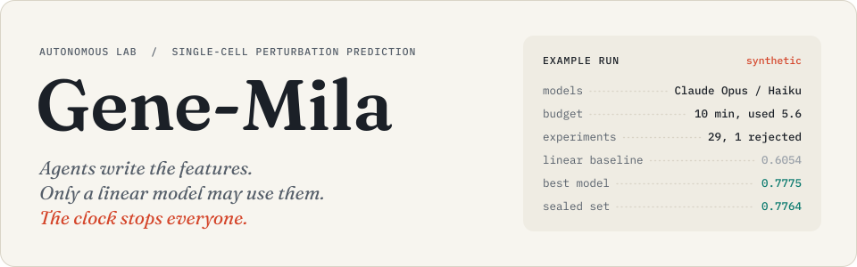

<p align="center">
  
</p>

Gene-Mila is a research lab run by LLM agents against a wall clock. Give it a single-cell
perturbation screen and a deadline (`--hours 6`): Claude plans as the principal investigator,
cheap worker models each turn one hypothesis into one feature, and Python fits a ridge, lasso,
elastic net or OLS model, scores it, and kills everything when time is up. The predictor never
gets cleverer, so every gain arrives as a named feature with a coefficient you can read.

**The question.** Constraining the predictor makes the biological signal explicit. Gene-Mila
asks how far LLM agents can take a linear model on perturbations nobody has measured, within a
fixed time budget, and which signals the gain comes from. The task is the unpaired one: given
control cells and the identity of an unseen knockout, predict every gene's change in mean
expression. Because each experiment adds one named feature and is scored by code, the answer
is a lineage of features with coefficients, not a black box.

> [!NOTE]
> Every score on this page comes from a synthetic knockout screen with known biology. No real
> dataset has been scored yet; Adamson on CellForge's splits is next
> ([where this is going](#where-this-is-going)).

## What one run looks like

<p align="center">
  
</p>

Claude Opus planned and four Claude Haiku workers wrote code against a synthetic knockout
screen: 300 genes, 1,000 control cells and 48 training perturbations, generated from gene
modules and a sparse regulatory network, with noisy prior knowledge to draw on. The budget was
10 minutes. The run ended itself at 5.6, when its four planner rounds were used up.

Three worker-written features, added one per experiment, took pearson_delta on visible
validation from 0.6054 to 0.7775. Then the sealed query-only set was opened, once: the winner
scored 0.7764 and the baseline 0.5942, so the gain held on perturbations no agent was ever
scored on. Summary, planner batch, research state and analysis are in
[`docs/example_run/`](docs/example_run/).

### The feature behind the last step

Worker W000 wrote `tf_gated_coexpression` in one LLM call, in its own git worktree, from a
30-line API reference and one example plugin. It takes the knocked-out gene's co-expression
row from control cells and splits it into two columns, one used when the target is a
transcription factor and one when it is not (excerpt;
[full file](docs/example_run/tf_gated_coexpression_e26.py)):

```python
@register
class TFGatedCoexpressionE26(Feature):
    name = "tf_gated_coexpression_e26"
    ...
    rationale = "TF targets propagate knockouts along co-expression; non-TF targets mostly reflect shared drivers"
    ...
    def compute(self, ctx: FeatureContext, perts: list[str], params: dict) -> np.ndarray:
        out = np.zeros((len(perts), ctx.n_genes, 2))
        tf_list = ctx.knowledge('transcription_factors')
        ...
        corr_matrix = ctx.gene_corr
        for i, p in enumerate(perts):
            ...
            target_corr = corr_matrix[target_idx, :].copy()
            ...
            is_tf = 1.0 if target_gene in tf_set else 0.0
            tf_part = target_corr * is_tf
            nontf_part = target_corr * (1.0 - is_tf)
            out[i, :, 0] = tf_part
            out[i, :, 1] = nontf_part
        return out
```

The synthetic run's final model is ridge (alpha = 100) on standardised features, so the
coefficients are comparable in size. This is the whole model:

| Feature | Written by | Coefficient |
|---|---|--:|
| `mean_response` | built in | +0.1040 |
| `target_knockdown_scaled_e24` | worker W000, EXP_0024 | +0.0948 |
| `target_coexpression_e7` | worker W002, EXP_0007 | +0.0404 |
| `tf_gated_coexpression_e26[0]` | worker W000, EXP_0026 | −0.0305 |
| `tf_gated_coexpression_e26[1]` | worker W000, EXP_0026 | −0.0254 |
| `is_target` | built in | +0.0121 |
| `control_mean` | built in | +0.0012 |

### What the lab threw out

In the same synthetic run, EXP_0027 never reached a model. Its smoke test replaced training
perturbation G0000_KO's label with noise and the feature's rows for G0000_KO changed: the
feature was reading its own answer. The error went back to the worker, the fix failed the same
test, and the experiment was recorded as failed with the hint `use ctx.train_delta(exclude=p)`.
Twelve sweeps that the controller generated without an LLM call changed nothing at four
decimals, and two worker features made the model slightly worse (−0.0002 and −0.0030). All of
it stays in `lab.db` next to the wins.

### Cheaper workers, same rules

A second synthetic test ([report](docs/deepseek_test_2026-10-03.md)) kept Claude Opus as
planner and used DeepSeek workers. Four workers ran 11 experiments, each in its own worktree
commit, and none failed. The best feature, `net_diffusion_signed` (the knockout's signed
propagation through the prior regulatory network), reached 0.7980 against the same 0.6054
baseline. DeepSeek's bill for the whole test was about $0.022, or $0.0015 per experiment at peak
rates. The same test found the next limit: at 44 workers the planner, not CPU or DeepSeek,
caps throughput.

## How it works

<p align="center">
  
</p>

Six rules make a gain mean something. Each is enforced in code, not in a prompt.

| | Rule | How the code enforces it |
|:-:|---|---|
| **1** | **The clock kills everything.** A run gets `--minutes` or `--hours`, and nothing outlives them by much. | At the deadline the controller stops new experiments and LLM calls, gives running fits `run.shutdown_grace_s` (30 s), then kills them. `run_research.py` runs the lab as its own process group and SIGKILLs the group if it is still alive 180 s later, then writes the summary from `lab.db`. Completed models are kept. |
| **2** | **Linear models only.** Ridge, lasso, elastic net or OLS, on CPU. | Any other model type is refused when the experiment is specified (`ALLOWED_MODELS` in `genemila/spec.py`). Fits run in a limited subprocess with a wall timeout, `RLIMIT_CPU` and `RLIMIT_AS`. The controller picks alpha on visible validation. |
| **3** | **One new feature per experiment**, so a score change has one candidate cause. | A worker may change exactly one file, its plugin under `genemila/features/plugins/`. The diff guard rejects any other edit and any touch of the evaluator, data, splits or guards (`genemila/guard.py`). |
| **4** | **Numbers decide, never an LLM.** | The controller scores every experiment with its own evaluator (`genemila/benchmark/evaluator.py`). Ranking, sweeps, replicates, duplicate detection and scheduling are Python. |
| **5** | **The sealed set is read once, at the end.** | Perturbations are split 60/20/20 into train, visible validation and query-only validation, hashed into a `split_id`. Experiments predict both validation sets without knowing which is which. Only `QueryOracle` reads the query-only labels, after the run, for the top `final.top_k` candidates and at most `final.max_queries` times, every query logged. |
| **6** | **Every feature is tested for leakage.** | Before a feature runs, the smoke test swaps one training perturbation's label for noise and checks the feature's rows for it do not move. It also checks shape, NaN, determinism and constancy. An AST guard allows numeric imports only: no file I/O, network, processes or reflection. |

<details>
<summary>Also enforced: compute, spend, spec hygiene, integrity</summary>

| Guard | Mechanism |
|---|---|
| Compute | Per-experiment wall timeout, `RLIMIT_CPU` and `RLIMIT_AS` (Linux) plus RSS polling; one CPU-slot semaphore shared by all workers (`--cpu-slots`). |
| Spend | The worst-case cost of every LLM call is reserved before the call. A call that could cross a per-run cap or the cumulative per-provider cap in `runs/spend_ledger.sqlite` is refused before it reaches the provider. A circuit breaker stops a provider after repeated API failures. |
| Spec hygiene | Every experiment states a hypothesis and a rationale; at most 3 changes from its parent (more than 1 is flagged); no hidden-label, evaluator or split language; duplicate configurations are skipped. |
| Integrity | Dataset file hashes and the split id are verified at start. Each experiment's code is committed and pinned at `refs/genemila/<run>/<experiment>`. |
| Validation labels | Experiment subprocesses receive only `public.npz` (control cells, training labels, perturbation metadata) and predict every non-training perturbation; the controller scores them. |

</details>

### The prediction

For perturbation $p$ and gene $g$, one linear model shared across all rows predicts the change
in mean expression:

$$
\Delta_{p,g} \;=\; \bar{x}_{g \mid p} \;-\; \bar{x}_{g \mid \text{control}} \;\approx\; w^{\top} f(p, g) + b
$$

A feature $f$ maps $(p, g)$ to one or a few numbers (`genemila/features/api.py`), so each
coefficient is the weight of one named signal for every perturbation and gene. The primary
metric is `pearson_delta`: for each held-out perturbation, the Pearson correlation between
predicted and true change across genes, averaged. RMSE, MAE, top-20 DE Pearson and direction
accuracy are recorded alongside. Baselines run first: no change, the mean training response,
and OLS, ridge and lasso on control mean, leave-one-out mean response and a target indicator.

| Role | Who | Sees |
|---|---|---|
| Planner | Claude, through the `claude` CLI or the Anthropic API | A compressed research state of at most 12,000 characters, however long the run. Called when the queue runs low. |
| Workers | DeepSeek, Claude Haiku, or any OpenAI-compatible model | The spec, a 30-line API reference and one example plugin. Never the repository or the experiment history. |
| Controller | Python | Everything: deadline, queue, retries, concurrency, evaluation, the query-only oracle, SQLite. |

## Limitations

- **Synthetic data only, so far.** The `.h5ad` ingestor reads the scPerturb and GEARS layouts
  CellForge uses and is tested on a simulated screen, but it has not been run on Adamson:
  downloads were blocked in the build environment.
- **cell-eval sees the finalists only.** The search optimises in-house pseudobulk metrics;
  cell-eval scores the finalists and the best baseline at the end of a run on real data. No run
  documented here has cell-eval numbers yet.
- **Means, not cells.** The lab predicts each perturbation's mean expression change, so
  cell-eval's distribution metrics see a point mass per perturbation. Cell-level predictions
  would need a noise or sampling model on top of the linear mean model.
- **Process-level guards, not a sandbox.** They stop accidental or naive leakage. A determined
  program running as the same OS user could still find the private label files on disk; for
  untrusted models, run experiments as a separate user or in a container, or move
  `QueryOracle` to a remote service.
- **Short runs.** Both documented runs lasted minutes and ended when their planner-call cap ran
  out, before their deadline. No multi-hour or many-worker run is documented yet.

## Where this is going

The paper this lab is built for asks three questions:

- **How far?** On real screens and within hours, how close do agent-discovered features bring a
  linear model to CellForge on the same data and splits?
- **Which signals?** Which biology carries the gain? In the synthetic runs most of it came from
  control-cell co-expression with the knocked-out gene (+0.1579 in one step), and the DeepSeek
  run's best step added signed propagation through a prior regulatory network. The synthetic
  screen was generated from exactly those mechanisms, so that is a sanity check, not a finding.
- **Does it hold?** Does the gain survive a set no agent tuned against, under the same scoring as
  CellForge and VCWorld?

The team decided to keep building this lab rather than fork CellForge or VCWorld, and to make
the three directly comparable:

1. **Real screens on CellForge's splits.** Adamson first, then Norman. The ingestor and
   `--splits` already exist; the runs are next.
2. **Their scoring, after every experiment.** CellForge's and VCWorld's own evaluation, plus
   cell-eval, after every experiment and every run. Today cell-eval scores finalists only.
3. **The same game.** CellForge, VCWorld and Gene-Mila on the same datasets, the same splits and
   the same scoring.

Srivatsan's drug perturbations wait on drug metadata, because every feature today assumes a gene
target.

| | [CellForge](https://arxiv.org/abs/2508.02276) | [VCWorld](https://proceedings.iclr.cc/paper_files/paper/2026/file/767ff070c27c8954babe74eccf3fbe91-Paper-Conference.pdf) (ICLR 2026) | Gene-Mila |
|---|---|---|---|
| Agents produce | a trained perturbation-response model | differential-expression and direction-of-change predictions | features for a ridge, lasso, elastic net or OLS model |
| Data | Adamson, Norman, Srivatsan (about 100k cells) | C32, HepG2C3A, HOP62, Hs 766T, PANC-1 (about 1M cells) | synthetic screens so far |

---

## Quick start

```bash
pip install -r requirements.txt
python -m pytest -q                                   # about a minute

# offline dry run: mock workers + scripted planner, synthetic data (no API keys)
python run_research.py --minutes 2 --workers 4 --worker-provider mock --planner-provider scripted

# Claude plans, DeepSeek implements (needs DEEPSEEK_API_KEY and the claude CLI)
python deepseek_check.py                              # ONE minimal API call, prints tokens and cost
python run_research.py --minutes 3 --workers 1 --max-planner-calls 1   # one-worker cycle
python run_research.py --minutes 6 --workers 4 --max-planner-calls 2   # four-worker test

# the example run on this page (Claude Opus plans, Claude Haiku implements)
python run_research.py --minutes 10 --workers 4 --worker-provider claude_cli --worker-model haiku \
    --planner-provider claude_cli --planner-model opus --budget 1.5 --max-planner-calls 4
```

Watch a run, then take it apart:

```bash
python status.py                     # live state (add --watch 5)
python leaderboard.py                # ranked experiments; --all includes failures
python leaderboard.py --lineage EXP_0012
python summarize.py --state          # the compressed research state the planner sees
python summarize.py                  # regenerate the run summary
python reproduce.py --experiment EXP_0012
python analyze_run.py                # worker independence, tokens, cost, bottlenecks, projections
```

Every command defaults to the most recent run under `runs/`; pass `--run runs/<id>` to pick one.

### Scaling (only after the 4-worker test is reviewed)

```bash
python run_research.py --minutes 20 --workers 8  --budget 1.00
python run_research.py --minutes 20 --workers 16 --budget 2.00
python run_research.py --hours 1    --workers 44 --budget 5.00 --set budget.cumulative_usd.deepseek=10
```

Experiments fork from a warm server process and reuse cached feature blocks within a run, which
cut CPU per experiment from 1.42 s to 0.07 s with bit-identical predictions (see "CPU
efficiency" in `docs/ARCHITECTURE.md`); set `--set experiment.executor="subprocess"` to use a
fresh interpreter per experiment instead. `--workers` sets LLM worker slots; `--cpu-slots`
(default: number of cores) caps simultaneous CPU experiments independently, so 44 workers on an
8-core machine queue politely for CPU while the others are writing code. Raise
`budget.cumulative_usd.deepseek` deliberately when you want to spend beyond the $0.25
development cap.

## Data

`python prepare_data.py synthetic` builds a small synthetic knockout screen with known
biology (gene modules → co-expression, a sparse regulatory network, a shared stress
response) plus noisy prior knowledge (`gene_sets`, `prior_network`,
`transcription_factors`). It is the fixture used for tests and development.

Real data. The ingestor reads both layouts CellForge uses: scPerturb files (raw counts,
`obs['perturbation']`, e.g. `AdamsonWeissman2016_GSM2406681_10X010.h5ad` from
https://zenodo.org/records/13350497) and GEARS files (`perturb_processed.h5ad`,
`obs['condition']` with `GENE+ctrl`). It normalises raw counts (counts per 10k, log1p),
parses target genes out of labels (guides for the same gene are merged; `GENEA+GENEB`
doubles are kept), keeps highly variable genes plus every target gene, and splits by
perturbation. `--splits` takes an external split (train/val1/val2 or train/val/test lists),
e.g. CellForge's, instead of ours.

```bash
pip install anndata cell-eval
python prepare_data.py describe AdamsonWeissman2016_GSM2406681_10X010.h5ad
python prepare_data.py h5ad --name adamson --h5ad AdamsonWeissman2016_GSM2406681_10X010.h5ad --hvg 2000
python run_research.py --dataset adamson --minutes 20 --workers 4
```

### cell-eval

Each bundle also keeps, privately, the cells of held-out perturbations and a separate
sample of control cells. At the end of a run the finalists (and the best baseline) are
scored with Arc Institute's [cell-eval](https://github.com/ArcInstitute/cell-eval) on the
visible validation set, and on the query-only set as part of the same capped oracle query.
A prediction becomes (held-out control mean + predicted delta) repeated for each real
cell, as cell-eval's own mean baseline does, so pseudobulk metrics (pearson_delta, mse,
DE overlap/precision, discrimination score) are comparable with other methods while
distribution metrics treat the prediction as a point mass. Results land in
`summary.md` / `summary.json` and `runs/<run>/celleval/`. Turn it off with
`--set final.celleval=false`; `final.celleval_profile` picks the metric set.
Every experiment is also scored with CellForge's and VCWorld's published metrics
(see `docs/ARCHITECTURE.md`), and the summary has a table for each.

## Configuration

`configs/default.toml` holds every knob (workers, CPU slots, timeouts, RAM, retries,
exploration mix, providers and models, budgets, prices). Override with `--config my.toml`
or `--set section.key=value`. DeepSeek prices are set to the
published peak-hour rates for `deepseek-flash` (what the API serves for `deepseek-chat`)
and `deepseek-v4-pro`; update `[pricing.*]` if they change, and run
`python reprice_ledger.py --apply` to recompute the spend ledger with new prices.

## Providers

`genemila/providers/` hides every model behind `AgentProvider` (`propose`, `implement`,
`diagnose`, `summarize`; a backend only needs `complete()`):
`claude_cli`, `anthropic`, `deepseek`, `openai_compat` (OpenAI, Grok, vLLM/Ollama/OpenCode
servers via `[providers.openai_compat] base_url / api_key_env`), `mock`, `scripted`.
Escalation: set `worker.escalation_provider`/`escalation_model` and a failing cheap-model
implementation (after `llm_retries` fixes) is handed to the stronger model once.

## Outputs of a run (`runs/<id>/`)

`lab.db` (everything, failures included), `artifacts/EXP_xxxx/` (spec, every LLM attempt,
smoke reports, plugin file, predictions, fitted models, metrics, logs), `feature_store/`,
`planner/` (state given to the planner and its raw plans), `celleval/`, `controller.log`,
`summary.md`, `summary.json`. Experiment code is pinned at `refs/genemila/<run>/<experiment>`.

## Architecture

<details>
<summary>Process tree: who owns what</summary>

```
run_research.py  (external watchdog: hard-kills the lab if it overruns, then writes the summary)
└── Controller  (owns deadline, scheduling, concurrency, retries, persistence; never an LLM)
    ├── Planner / PI ── LLMGateway ── Claude (claude CLI or Anthropic API)
    │      reads compressed research state, proposes hypotheses (JSON)
    │      Python expands sweeps, replicates, parents, explore/exploit/risky priorities
    ├── SQLite lab.db: queue, experiments (incl. failures), features, LLM calls, planner rounds
    ├── N worker slots (threads; 4 → 8 → 16 → 44 → 64 by --workers)
    │      claim → git worktree → [LLM writes ONE plugin file] → static guard → smoke test
    │      (shape, NaN, determinism, label-leakage) → diff guard → commit + pinned ref
    │      → CPU experiment subprocess (timeout, RAM, CPU limits; capped by --cpu-slots)
    │      → controller-side evaluation → record → feature store
    ├── LLMGateway: spend caps (per run, per role, cumulative per provider), token caps,
    │      bounded retries, circuit breaker, token/cost accounting for every call
    └── Final: query-only evaluation of top candidates, cell-eval on real data,
           summary.md + summary.json
```

</details>

Module map, token and CPU budgets, failure handling and current limitations are in
[`docs/ARCHITECTURE.md`](docs/ARCHITECTURE.md). The figures on this page are drawn from the run
reports by [`docs/assets/build_figures.py`](docs/assets/build_figures.py).
